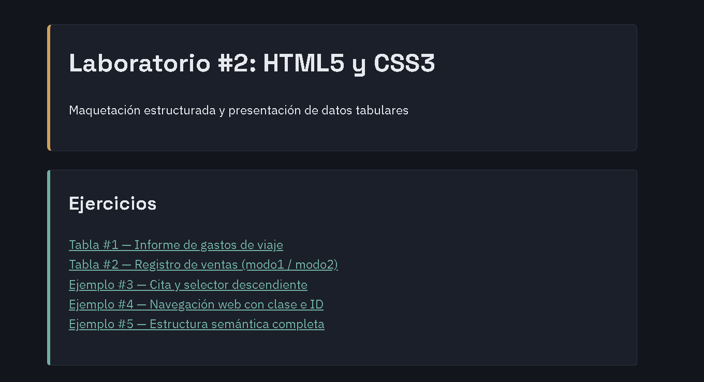
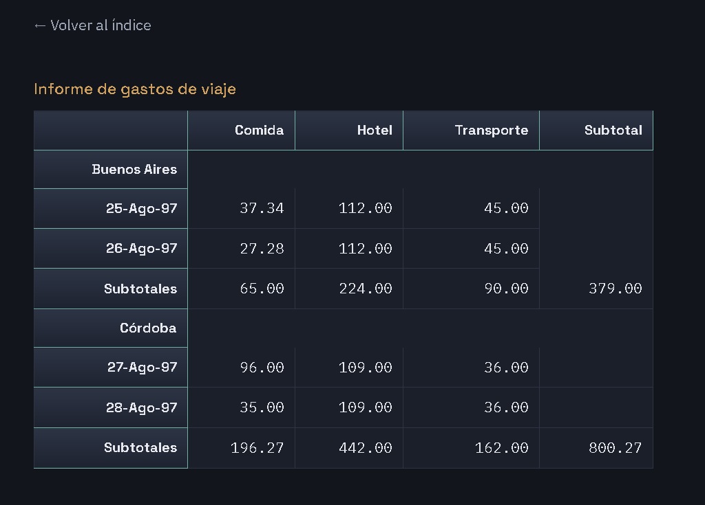
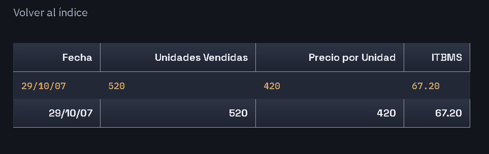
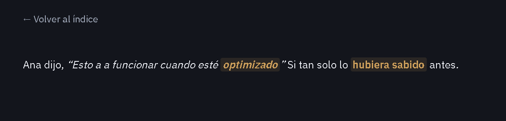

# 🎨 Laboratorio #2: HTML5 y CSS3

Este repositorio reúne la práctica de maquetación estructurada y presentación de datos tabulares del curso de Desarrollo Web, enfocada en:

- Configuración de metadatos del documento (`charset`, `viewport`, `description`)
- Elementos semánticos y estructurales de HTML5 (`header`, `nav`, `main`, `section`, `article`, `aside`, `footer`)
- Estructuración de datos con tablas HTML (`table`, `tr`, `th`, `td`) y atributos de accesibilidad (`headers`, `id`, `axis`)
- Hipervínculos seguros con `target="_blank"` y `rel="noopener"`
- Selectores CSS aplicados: etiqueta, clase (`.class`) e identificador (`#id`)

---

## 🌐 Tecnologías y versiones


| Tecnología | Versión | Uso |
| --- | --- | --- |
| HTML | 5 | Estructura de las páginas |
| CSS | 3 | Estilos (hoja externa `estilos.css`) |
| Apache | _(escribe tu versión, ej. 2.4.x)_ | Servidor web local (opcional) |
| WampServer | _(escribe tu versión, ej. 3.x)_ | Entorno local (opcional) |
| Visual Studio Code | _(escribe tu versión)_ | Editor de código |

---

## 📁 Detalles del laboratorio

| Archivo | Descripción |
| --- | --- |
| `index.html` | Página de índice con enlaces a los 5 ejercicios |
| `tabla_1.html` | Tabla #1: informe de gastos de viaje (filas agrupadas por ciudad) |
| `tabla_2.html` | Tabla #2: registro de ventas con clases `modo1` / `modo2` |
| `Cita y selector.html` | Ejemplo #3: cita con `<q>` y selector descendiente `p strong` |
| `Navegación Web.html` | Ejemplo #4: sección con clase `.card-seccion`, ID `#footer-recurso` y enlace externo seguro |
| `estructuras_semánticas.html` | Ejemplo #5: estructura completa con etiquetas semánticas de HTML5 |
| `estilos.css` | Hoja de estilos externa aplicada a todos los ejercicios |

---

## 🎛️ Controles utilizados

| Control / elemento | Uso en el laboratorio |
| --- | --- |
| `<table>`, `<tr>`, `<th>`, `<td>` | Tablas de gastos de viaje y de ventas |
| Atributos `headers`, `id`, `axis` | Accesibilidad de las celdas de las tablas |
| `<q>` y `<strong>` | Cita textual y texto resaltado (Ejemplo #3) |
| `<a target="_blank" rel="noopener">` | Enlaces externos seguros (Ejemplo #4) |
| `<header>`, `<nav>`, `<main>`, `<section>`, `<article>`, `<aside>`, `<footer>` | Estructura semántica (Ejemplo #5) |
| Selectores CSS: etiqueta, clase, ID, descendiente | Estilos de `estilos.css` |

---

## 🖼️ Evidencia de ejecución

### ➕ Insertar registros

No aplica en este laboratorio: son páginas estáticas de HTML y CSS, sin formularios ni base de datos. Los "registros" son los datos escritos directamente en las tablas.

**Índice de ejercicios** (`index.html`)



**Tabla #1: Informe de gastos de viaje** (`tabla_1.html`)



**Tabla #2: Registro de ventas** (`tabla_2.html`)

Se muestran las dos filas con las clases `modo1` y `modo2`:



**Ejemplo #3: Cita y selector descendiente** (`Cita y selector.html`)



### ✏️ Modificar

No aplica en este laboratorio: las páginas son estáticas y no permiten modificar datos desde el navegador.

### 🗑️ Eliminar

No aplica en este laboratorio: las páginas son estáticas y no permiten eliminar datos desde el navegador.

---

## ⚙️ Procesos de instalación

Los archivos son HTML y CSS puro, así que **se pueden abrir directo en el navegador**, sin servidor. Si prefieres usar un servidor local, funciona con **WampServer** (Windows) o **XAMPP**.

📌 Estas herramientas son entornos simulados en tu equipo y no deben confundirse con servidores de producción.

1. Clona el repositorio:

   ```bash
   git clone https://github.com/elizaacevedo1024-star/Laboratorio2_HTML5_CSS3.git
   ```

2. **Opción A (sin servidor):** abre `index.html` con doble clic.

3. **Opción B (con servidor local):** guarda la carpeta dentro de `www` (WampServer) o `htdocs` (XAMPP), inicia Apache y abre:

   `http://localhost/Laboratorio2_HTML5_CSS3/index.html`

---

## 👨‍💻 Autora y fecha

**Elizabeth Acevedo**
Estudiante de licenciatura en Ciberseguridad
Universidad Tecnológica de Panamá

- 📧 **Email:** elizabeth.acevedo@utp.ac.pa
- 🌐 **GitHub:** https://github.com/elizaacevedo1024-star
- 📅 **Fecha:** 08-10-2026

---

## 📚 Referencias

- MDN, HTML: https://developer.mozilla.org/es/docs/Web/HTML
- MDN, CSS: https://developer.mozilla.org/es/docs/Web/CSS
- MDN, Elementos semánticos de HTML5: https://developer.mozilla.org/es/docs/Glossary/Semantics
- MDN, Tablas HTML: https://developer.mozilla.org/es/docs/Learn_web_development/Core/Structuring_content/HTML_table_basics
- W3C, Validador de HTML: https://validator.w3.org/
